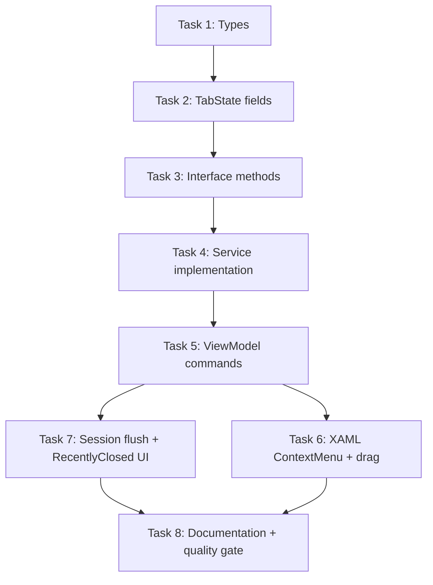

# S2-009 Implementation Plan: File Tree CRUD + Session & Crash Recovery

> **For agentic workers:** REQUIRED SUB-SKILL: Use superpowers:subagent-driven-development (recommended) or superpowers:executing-plans to implement this plan task-by-task. Steps use checkbox (`- [ ]`) syntax for tracking.

**Goal:** Add file tree CRUD (create/rename/remove/move) to `IWorkspaceService`, add session-based recovery and "recently closed" persistence, wire UI right-click menus and drag-to-editor.

**Architecture:** Extend `IWorkspaceService` with 4 CRUD methods + `CloseAndRemove`/`CloseAndMove` atomic operations + `FlushSession`/`LoadSession` + `GetRecentlyClosed`. Add `WorkspaceMutationResult`, `WorkspaceSessionState`, `RecentlyClosedEntry` types. Extend `WorkspaceTabState` with `HasUnsavedRecovery`/`IsMissingOnDisk`. UI: `FileTreeNodeViewModel` gets CRUD commands, `MainView.axaml` gets `ContextMenu` on tree nodes, `App.OnFrameworkInitializationCompleted` gets session flush on exit.

**Tech Stack:** .NET 10, C#, xUnit, Avalonia UI, CommunityToolkit.Mvvm

---

### Task 1: Add `WorkspaceMutationResult`, `WorkspaceSessionState`, `RecentlyClosedEntry` types

**Files:**
- Create: `Muse.Workspace/WorkspaceMutationResult.cs`
- Create: `Muse.Workspace/WorkspaceSessionState.cs`
- Create: `Muse.Workspace/RecentlyClosedEntry.cs`

- [ ] **Step 1: Create `WorkspaceMutationResult.cs`**

```csharp
namespace Muse.Workspace;

public sealed record WorkspaceMutationResult(
    bool Succeeded,
    string? Code,
    string? Message,
    string? AffectedPath);
```

- [ ] **Step 2: Create `WorkspaceSessionState.cs`**

```csharp
namespace Muse.Workspace;

public sealed record WorkspaceSessionState(
    string WorkspaceRoot,
    IReadOnlyList<string> OpenTabIds,
    DateTimeOffset SavedAt);
```

- [ ] **Step 3: Create `RecentlyClosedEntry.cs`**

```csharp
namespace Muse.Workspace;

public sealed record RecentlyClosedEntry(
    string FilePath,
    string FileName,
    DateTimeOffset ClosedAt,
    long? LastKnownSizeBytes);
```

**Self-review:** All types are pure records with no logic. No placeholders. Type names consistent.

---

### Task 2: Extend `WorkspaceTabState` with `HasUnsavedRecovery` and `IsMissingOnDisk`

**Files:**
- Modify: `Muse.Workspace/WorkspaceTabState.cs`

- [ ] **Step 1: Write test that verifies new fields exist**

```csharp
[Fact]
public void WorkspaceTabState_SupportsHasUnsavedRecoveryAndIsMissingOnDisk()
{
    var tab = new WorkspaceTabState("id", "/path/file.md", false, DateTimeOffset.UtcNow)
    {
        HasUnsavedRecovery = true,
        IsMissingOnDisk = true
    };

    Assert.True(tab.HasUnsavedRecovery);
    Assert.True(tab.IsMissingOnDisk);
}
```

Place in `Muse.Workspace.Tests/InMemoryWorkspaceServiceTests.cs` (or a new `WorkspaceTabStateTests.cs`).

- [ ] **Step 2: Run test to verify it fails**

Run: `dotnet test Muse.Workspace.Tests --filter "SupportsHasUnsavedRecovery" -v`
Expected: FAIL — new fields not yet on `WorkspaceTabState`.

- [ ] **Step 3: Add `HasUnsavedRecovery` and `IsMissingOnDisk` to `WorkspaceTabState`**

```csharp
namespace Muse.Workspace;

public sealed record WorkspaceTabState(
    string DocumentId,
    string FilePath,
    bool IsDirty,
    DateTimeOffset LastTouchedAt)
{
    public string FileName => System.IO.Path.GetFileName(FilePath);

    public bool HasExternalConflict { get; init; }

    public string? ConflictMessage { get; init; }

    // S2-009: session-based recovery
    public bool HasUnsavedRecovery { get; init; }

    public bool IsMissingOnDisk { get; init; }
}
```

- [ ] **Step 4: Run test to verify it passes**

Run: `dotnet test Muse.Workspace.Tests --filter "SupportsHasUnsavedRecovery" -v`
Expected: PASS

- [ ] **Step 5: Commit**

```bash
git add Muse.Workspace/WorkspaceTabState.cs Muse.Workspace.Tests/WorkspaceTabStateTests.cs
git commit -m "feat: add HasUnsavedRecovery and IsMissingOnDisk fields to WorkspaceTabState"
```

---

### Task 3: Add CRUD methods to `IWorkspaceService` interface

**Files:**
- Modify: `Muse.Workspace/IWorkspaceService.cs`

- [ ] **Step 1: Write test that verifies new interface methods exist at compile time**

All new methods will be stubbed as `NotImplementedException` in the service and the test calls them to verify they compile. This test file may be merged with the implementation test in the next task.

- [ ] **Step 2: Add new methods to `IWorkspaceService`**

```csharp
// --- File tree CRUD ---
WorkspaceMutationResult CreateNode(string parentPath, string name, bool isDirectory);
WorkspaceMutationResult RenameNode(string path, string newName);
WorkspaceMutationResult RemoveNode(string path);
WorkspaceMutationResult MoveNode(string sourcePath, string targetDirectoryPath);

// --- Soft-flow atomic operations for open tabs ---
WorkspaceMutationResult CloseAndRemove(string path);
WorkspaceMutationResult CloseAndMove(string path, string targetDirectoryPath);

// --- Session persistence ---
WorkspaceSessionState? GetLastSession();
void FlushSession();
void InvalidateSession();

// --- Recently closed ---
IReadOnlyList<RecentlyClosedEntry> GetRecentlyClosed();
void RemoveFromRecentlyClosed(string path);
```

- [ ] **Step 3: Make `FakeWorkspaceService` (in `Muse.Tests/MainViewModelWorkspaceIntegrationTests.cs`) compile**

Add the new methods to `FakeWorkspaceService` using default returns:

```csharp
public WorkspaceMutationResult CreateNode(string parentPath, string name, bool isDirectory)
    => new WorkspaceMutationResult(true, "created", null, null);
public WorkspaceMutationResult RenameNode(string path, string newName)
    => new WorkspaceMutationResult(true, "renamed", null, null);
public WorkspaceMutationResult RemoveNode(string path)
    => new WorkspaceMutationResult(true, "removed", null, null);
public WorkspaceMutationResult MoveNode(string sourcePath, string targetDirectoryPath)
    => new WorkspaceMutationResult(true, "moved", null, null);
public WorkspaceMutationResult CloseAndRemove(string path)
    => new WorkspaceMutationResult(true, "closed_and_removed", null, null);
public WorkspaceMutationResult CloseAndMove(string path, string targetDirectoryPath)
    => new WorkspaceMutationResult(true, "closed_and_moved", null, null);
public WorkspaceSessionState? GetLastSession() => null;
public void FlushSession() { }
public void InvalidateSession() { }
public IReadOnlyList<RecentlyClosedEntry> GetRecentlyClosed() => Array.Empty<RecentlyClosedEntry>();
public void RemoveFromRecentlyClosed(string path) { }
```

- [ ] **Step 4: Build whole solution to verify no compile errors**

Run: `dotnet build Muse.sln`
Expected: BUILD SUCCEEDED

- [ ] **Step 5: Commit**

```bash
git add Muse.Workspace/IWorkspaceService.cs Muse.Tests/MainViewModelWorkspaceIntegrationTests.cs
git commit -m "feat: add CRUD, session, and recently-closed methods to IWorkspaceService"
```

---

### Task 4: Implement CRUD + session + recently-closed in `InMemoryWorkspaceService`

**Files:**
- Modify: `Muse.Workspace/InMemoryWorkspaceService.cs`
- Test: `Muse.Workspace.Tests/InMemoryWorkspaceServiceTests.cs`

- [ ] **Step 1: Add `_recentlyClosed` field and constants to `InMemoryWorkspaceService`**

```csharp
private const int MaxRecentlyClosedEntries = 20;
private readonly List<RecentlyClosedEntry> _recentlyClosed = [];
private static readonly JsonSerializerOptions _jsonOptions = new()
{
    WriteIndented = false,
    PropertyNamingPolicy = JsonNamingPolicy.CamelCase
};
```

Also add a `static` `JsonSerializerOptions` field to the class for consistent JSON options.

- [ ] **Step 2: Write the `CreateNode_ShouldCreateFileAndRefreshTree` test (and `CreateNode` implementation)**

First write the test:

```csharp
[Fact]
public void CreateNode_ShouldCreateFileAndRefreshTree()
{
    var root = CreateWorkspaceFixture();
    try
    {
        var service = new InMemoryWorkspaceService();
        service.OpenWorkspace(root);

        var result = service.CreateNode(root, "new-file.md", isDirectory: false);

        Assert.True(result.Succeeded);
        Assert.Equal("created", result.Code);
        Assert.NotNull(result.AffectedPath);
        Assert.True(File.Exists(Path.Combine(root, "new-file.md")));
        var tree = service.GetState().FileTree;
        Assert.Contains(tree[0].Children, n => !n.IsDirectory && n.Name == "new-file.md");
    }
    finally
    {
        Directory.Delete(root, true);
    }
}
```

Run it: `dotnet test Muse.Workspace.Tests --filter "CreateNode_ShouldCreateFileAndRefreshTree" -v`
Expected: FAIL

- [ ] **Step 3: Implement `CreateNode`**

```csharp
public WorkspaceMutationResult CreateNode(string parentPath, string name, bool isDirectory)
{
    var validation = ValidateNodeName(name);
    if (validation is not null) return validation;

    var normalizedParent = NormalizePath(parentPath);
    if (!IsUnderWorkspaceRoot(normalizedParent, out var outside))
        return WorkspaceMutationResult.Failure("outside_workspace", "目标位置不在当前工作区。");

    var fullPath = NormalizePath(Path.Combine(normalizedParent, name));
    if (IsInternalWorkspacePath(fullPath))
        return WorkspaceMutationResult.Failure("forbidden_path", "不允许操作工作区内部目录。");

    try
    {
        if (isDirectory)
        {
            if (Directory.Exists(fullPath))
                return WorkspaceMutationResult.Failure("path_conflict", "目标路径已存在。");
            Directory.CreateDirectory(fullPath);
        }
        else
        {
            if (File.Exists(fullPath))
                return WorkspaceMutationResult.Failure("path_conflict", "目标路径已存在。");
            Directory.CreateDirectory(normalizedParent); // ensure parent exists
            File.Create(fullPath).Dispose();
        }
    }
    catch (Exception ex)
    {
        return WorkspaceMutationResult.Failure("io_error", $"文件操作失败：{ex.Message}");
    }

    RefreshWorkspaceFromDisk();
    return WorkspaceMutationResult.Success("created", fullPath);
}
```

Also add helper methods:

```csharp
private WorkspaceMutationResult? ValidateNodeName(string name)
{
    if (string.IsNullOrWhiteSpace(name))
        return WorkspaceMutationResult.Failure("invalid_name", "文件名不能为空。");
    if (name.StartsWith(".", StringComparison.Ordinal))
        return WorkspaceMutationResult.Failure("invalid_name", "文件名不能以点号开头。");
    if (name.IndexOfAny(System.IO.Path.GetInvalidFileNameChars()) >= 0)
        return WorkspaceMutationResult.Failure("invalid_name", "文件名包含非法字符。");
    return null;
}

private bool IsUnderWorkspaceRoot(string path, out bool outside)
{
    outside = false;
    var root = _state.WorkspaceRoot;
    if (string.IsNullOrWhiteSpace(root)) return false;
    var normalizedPath = NormalizePath(path);
    var normalizedRoot = NormalizePath(root);
    if (!normalizedPath.StartsWith(normalizedRoot, StringComparison.OrdinalIgnoreCase))
    {
        outside = true;
        return false;
    }
    return true;
}

// New static factory on WorkspaceMutationResult
public static WorkspaceMutationResult Success(string code, string path)
    => new WorkspaceMutationResult(true, code, null, path);

public static WorkspaceMutationResult Failure(string code, string message)
    => new WorkspaceMutationResult(false, code, message, null);
```

Run it: `dotnet test Muse.Workspace.Tests --filter "CreateNode_ShouldCreateFileAndRefreshTree" -v`
Expected: PASS

- [ ] **Step 4: Write CreateNode for directories test**

```csharp
[Fact]
public void CreateNode_ShouldCreateDirectoryAndRefreshTree()
{
    var root = CreateWorkspaceFixture();
    try
    {
        var service = new InMemoryWorkspaceService();
        service.OpenWorkspace(root);

        var result = service.CreateNode(root, "new-dir", isDirectory: true);

        Assert.True(result.Succeeded);
        Assert.True(Directory.Exists(Path.Combine(root, "new-dir")));
        var tree = service.GetState().FileTree;
        Assert.Contains(tree[0].Children, n => n.IsDirectory && n.Name == "new-dir");
    }
    finally
    {
        Directory.Delete(root, true);
    }
}
```

Run: PASS

- [ ] **Step 5: Write CreateNode validation tests**

```csharp
[Fact]
public void CreateNode_InvalidName_ShouldReturnInvalidName()
{
    var service = new InMemoryWorkspaceService();
    var root = CreateWorkspaceFixture();
    try
    {
        service.OpenWorkspace(root);
        Assert.Equal("invalid_name", service.CreateNode(root, "", false).Code);
        Assert.Equal("invalid_name", service.CreateNode(root, ".hidden", false).Code);
        Assert.Equal("invalid_name", service.CreateNode(root, "bad/name", false).Code);
    }
    finally { Directory.Delete(root, true); }
}

[Fact]
public void CreateNode_OutsideWorkspace_ShouldReturnOutsideWorkspace()
{
    var service = new InMemoryWorkspaceService();
    var root = CreateWorkspaceFixture();
    try
    {
        service.OpenWorkspace(root);
        var result = service.CreateNode(Path.Combine(Path.GetTempPath(), "outside"), "x.md", false);
        Assert.Equal("outside_workspace", result.Code);
    }
    finally { Directory.Delete(root, true); }
}
```

- [ ] **Step 6: Implement `RenameNode`**

```csharp
public WorkspaceMutationResult RenameNode(string path, string newName)
{
    var validation = ValidateNodeName(newName);
    if (validation is not null) return validation;

    var normalizedPath = NormalizePath(path);
    if (!IsUnderWorkspaceRoot(normalizedPath, out _))
        return WorkspaceMutationResult.Failure("outside_workspace", "源路径不在当前工作区。");

    var parentDir = System.IO.Path.GetDirectoryName(normalizedPath) ?? string.Empty;
    var newFullPath = NormalizePath(Path.Combine(parentDir, newName));

    try
    {
        if (newFullPath != normalizedPath && (File.Exists(newFullPath) || Directory.Exists(newFullPath)))
            return WorkspaceMutationResult.Failure("path_conflict", "目标路径已存在。");

        if (File.Exists(normalizedPath))
        {
            File.Move(normalizedPath, newFullPath);
        }
        else if (Directory.Exists(normalizedPath))
        {
            Directory.Move(normalizedPath, newFullPath);
        }
        else
        {
            return WorkspaceMutationResult.Failure("not_found", "源文件或目录不存在。");
        }

        // Update any open tab paths that match
        UpdateTabPaths(normalizedPath, newFullPath);
    }
    catch (Exception ex)
    {
        return WorkspaceMutationResult.Failure("io_error", $"重命名失败：{ex.Message}");
    }

    RefreshWorkspaceFromDisk();
    return WorkspaceMutationResult.Success("renamed", newFullPath);
}

private void UpdateTabPaths(string oldPath, string newPath)
{
    var tabs = _state.OpenTabs.ToList();
    bool changed = false;
    for (int i = 0; i < tabs.Count; i++)
    {
        if (tabs[i].FilePath.StartsWith(oldPath, StringComparison.OrdinalIgnoreCase))
        {
            var newFilePath = newPath + tabs[i].FilePath.Substring(oldPath.Length);
            tabs[i] = tabs[i] with { FilePath = newFilePath, DocumentId = newPath };
            // update draft content key
            if (_draftContents.TryGetValue(oldPath, out var content))
            {
                _draftContents[newPath] = content;
                _draftContents.Remove(oldPath);
            }
            // update recovery snapshot
            RemoveRecoverySnapshot(tabs[i].DocumentId);
            WriteRecoverySnapshot(tabs[i].DocumentId, content ?? string.Empty);
            changed = true;
        }
    }
    if (changed)
        _state = _state with { OpenTabs = tabs };
}
```

- [ ] **Step 7: Write RenameNode tests and run them**

```csharp
[Fact]
public void RenameNode_ShouldRenameFileAndUpdateOpenTabPath()
{
    var root = CreateWorkspaceFixture();
    try
    {
        var service = new InMemoryWorkspaceService();
        service.OpenWorkspace(root);
        var tabRes = service.OpenDocument(Path.Combine(root, "README.md"));
        var tab = tabRes.Tab!;

        var result = service.RenameNode(tab.FilePath, "NEWREADME.md");

        Assert.True(result.Succeeded);
        Assert.Equal("renamed", result.Code);
        Assert.True(File.Exists(Path.Combine(root, "NEWREADME.md")));
        Assert.False(File.Exists(Path.Combine(root, "README.md")));
        var updatedTab = service.GetState().OpenTabs.First(t => t.DocumentId == result.AffectedPath);
        Assert.NotNull(updatedTab);
    }
    finally { Directory.Delete(root, true); }
}

[Fact]
public void RenameNode_PathConflict_ShouldReturnPathConflict()
{
    var root = CreateWorkspaceFixture();
    try
    {
        var service = new InMemoryWorkspaceService();
        service.OpenWorkspace(root);
        File.WriteAllText(Path.Combine(root, "existing.md"), "exists");

        var result = service.RenameNode(Path.Combine(root, "README.md"), "existing.md");

        Assert.False(result.Succeeded);
        Assert.Equal("path_conflict", result.Code);
    }
    finally { Directory.Delete(root, true); }
}
```

Run and verify PASS.

- [ ] **Step 8: Implement `RemoveNode` and `CloseAndRemove`**

```csharp
public WorkspaceMutationResult RemoveNode(string path)
{
    var normalizedPath = NormalizePath(path);
    if (!IsUnderWorkspaceRoot(normalizedPath, out _))
        return WorkspaceMutationResult.Failure("outside_workspace", "路径不在当前工作区。");

    // Check if any open tab matches
    var matchingTabs = _state.OpenTabs.Where(t => t.FilePath == normalizedPath).ToList();
    if (matchingTabs.Count > 0 && matchingTabs.Any(t => t.IsDirty))
        return WorkspaceMutationResult.Failure("open_tab_unsaved", "该文件处于打开且未保存状态，请先保存或关闭。");
    if (matchingTabs.Count > 0)
        return WorkspaceMutationResult.Failure("open_tab_unsaved", "该文件已打开，请先关闭标签。");

    return ExecuteRemove(normalizedPath);
}

public WorkspaceMutationResult CloseAndRemove(string path)
{
    var normalizedPath = NormalizePath(path);
    // Soft flow: close tab first, then remove
    try
    {
        // save if dirty
        var tab = _state.OpenTabs.FirstOrDefault(t => t.FilePath == normalizedPath);
        if (tab is not null && tab.IsDirty)
        {
            var saveResult = SaveDocument(tab.DocumentId, GetDraftContent(tab.DocumentId) ?? string.Empty);
            if (!saveResult.Succeeded)
                return WorkspaceMutationResult.Failure("io_error", "自动保存失败，无法删除。");
        }
        // close tab
        if (tab is not null)
            CloseDocument(tab.DocumentId);
        // remove file
        return ExecuteRemove(normalizedPath);
    }
    catch (Exception ex)
    {
        return WorkspaceMutationResult.Failure("io_error", $"删除失败：{ex.Message}");
    }
}

private WorkspaceMutationResult ExecuteRemove(string normalizedPath)
{
    try
    {
        if (File.Exists(normalizedPath))
        {
            File.Delete(normalizedPath);
        }
        else if (Directory.Exists(normalizedPath))
        {
            Directory.Delete(normalizedPath, recursive: true);
        }
        else
        {
            return WorkspaceMutationResult.Failure("not_found", "文件或目录不存在。");
        }

        // Add to recently closed
        AddToRecentlyClosed(normalizedPath);
        // Remove recovery snapshot
        RemoveRecoverySnapshot(normalizedPath);
    }
    catch (Exception ex)
    {
        return WorkspaceMutationResult.Failure("io_error", $"删除失败：{ex.Message}");
    }

    RefreshWorkspaceFromDisk();
    return WorkspaceMutationResult.Success("removed", normalizedPath);
}

private void AddToRecentlyClosed(string normalizedPath)
{
    long? size = null;
    try { size = File.Exists(normalizedPath) ? new FileInfo(normalizedPath).Length : null; } catch { }
    _recentlyClosed.Insert(0, new RecentlyClosedEntry(
        normalizedPath,
        System.IO.Path.GetFileName(normalizedPath),
        DateTimeOffset.UtcNow,
        size));
    if (_recentlyClosed.Count > MaxRecentlyClosedEntries)
        _recentlyClosed.RemoveRange(MaxRecentlyClosedEntries, _recentlyClosed.Count - MaxRecentlyClosedEntries);
}
```

- [ ] **Step 9: Write RemoveNode tests and run them**

```csharp
[Fact]
public void RemoveNode_ShouldDeleteFileAndAddToRecentlyClosed()
{
    var root = CreateWorkspaceFixture();
    try
    {
        var service = new InMemoryWorkspaceService();
        service.OpenWorkspace(root);
        var filePath = Path.Combine(root, "README.md");

        var result = service.RemoveNode(filePath);

        Assert.True(result.Succeeded);
        Assert.False(File.Exists(filePath));
        Assert.Contains(service.GetRecentlyClosed(), e => e.FilePath == Path.GetFullPath(filePath).Replace('\\', '/'));
    }
    finally { Directory.Delete(root, true); }
}

[Fact]
public void RemoveNode_DirtyTab_ShouldReturnOpenTabUnsaved()
{
    var root = CreateWorkspaceFixture();
    try
    {
        var service = new InMemoryWorkspaceService();
        service.OpenWorkspace(root);
        var tabRes = service.OpenDocument(Path.Combine(root, "README.md"));
        service.MarkDirty(tabRes.Tab!.DocumentId, true);

        var result = service.RemoveNode(Path.Combine(root, "README.md"));
        Assert.Equal("open_tab_unsaved", result.Code);
        Assert.True(File.Exists(Path.Combine(root, "README.md")));
    }
    finally { Directory.Delete(root, true); }
}
```

- [ ] **Step 10: Implement `MoveNode` and `CloseAndMove`**

```csharp
public WorkspaceMutationResult MoveNode(string sourcePath, string targetDirectoryPath)
{
    var normalizedSrc = NormalizePath(sourcePath);
    var normalizedTargetDir = NormalizePath(targetDirectoryPath);

    if (!IsUnderWorkspaceRoot(normalizedSrc, out _))
        return WorkspaceMutationResult.Failure("outside_workspace", "源路径不在当前工作区。");

    // Prevent moving a directory into itself or its own subtree
    if (normalizedTargetDir.StartsWith(normalizedSrc + "/", StringComparison.OrdinalIgnoreCase)
        || normalizedTargetDir == normalizedSrc)
        return WorkspaceMutationResult.Failure("outside_workspace", "不能将目录移动到自身或其子目录。");

    var newPath = NormalizePath(Path.Combine(normalizedTargetDir, System.IO.Path.GetFileName(normalizedSrc)));
    var matchingTabs = _state.OpenTabs.Where(t => t.FilePath == normalizedSrc).ToList();

    if (matchingTabs.Count > 0 && matchingTabs.Any(t => t.IsDirty))
        return WorkspaceMutationResult.Failure("open_tab_unsaved", "文件处于打开且未保存状态。");

    return ExecuteMove(normalizedSrc, newPath);
}

public WorkspaceMutationResult CloseAndMove(string sourcePath, string targetDirectoryPath)
{
    var normalizedSrc = NormalizePath(sourcePath);
    var normalizedTargetDir = NormalizePath(targetDirectoryPath);
    var newPath = NormalizePath(Path.Combine(normalizedTargetDir, System.IO.Path.GetFileName(normalizedSrc)));

    var tab = _state.OpenTabs.FirstOrDefault(t => t.FilePath == normalizedSrc);
    if (tab is not null && tab.IsDirty)
    {
        var saveResult = SaveDocument(tab.DocumentId, GetDraftContent(tab.DocumentId) ?? string.Empty);
        if (!saveResult.Succeeded)
            return WorkspaceMutationResult.Failure("io_error", "自动保存失败，无法移动。");
    }
    if (tab is not null)
        CloseDocument(tab.DocumentId);

    return ExecuteMove(normalizedSrc, newPath);
}

private WorkspaceMutationResult ExecuteMove(string normalizedSrc, string normalizedDest)
{
    try
    {
        if (File.Exists(normalizedDest) || Directory.Exists(normalizedDest))
            return WorkspaceMutationResult.Failure("path_conflict", "目标位置已存在同名文件或目录。");

        if (File.Exists(normalizedSrc))
        {
            Directory.CreateDirectory(System.IO.Path.GetDirectoryName(normalizedDest)!);
            File.Move(normalizedSrc, normalizedDest);
        }
        else if (Directory.Exists(normalizedSrc))
        {
            Directory.CreateDirectory(System.IO.Path.GetDirectoryName(normalizedDest)!);
            Directory.Move(normalizedSrc, normalizedDest);
        }
        else
        {
            return WorkspaceMutationResult.Failure("not_found", "源文件或目录不存在。");
        }

        UpdateTabPaths(normalizedSrc, normalizedDest);
    }
    catch (Exception ex)
    {
        return WorkspaceMutationResult.Failure("io_error", $"移动失败：{ex.Message}");
    }

    RefreshWorkspaceFromDisk();
    return WorkspaceMutationResult.Success("moved", normalizedDest);
}
```

- [ ] **Step 11: Implement session persistence methods**

```csharp
public WorkspaceSessionState? GetLastSession()
{
    var root = _state.WorkspaceRoot;
    if (string.IsNullOrWhiteSpace(root)) return null;
    return LoadSession(NormalizePath(root));
}

public void FlushSession()
{
    var root = _state.WorkspaceRoot;
    if (string.IsNullOrWhiteSpace(root)) return;
    WriteSession(NormalizePath(root));
}

public void InvalidateSession()
{
    var root = _state.WorkspaceRoot;
    if (string.IsNullOrWhiteSpace(root)) return;
    var path = GetSessionPath(NormalizePath(root));
    try { if (File.Exists(path)) File.Delete(path); } catch { }
}

public IReadOnlyList<RecentlyClosedEntry> GetRecentlyClosed()
{
    // Load from disk
    var root = _state.WorkspaceRoot;
    if (string.IsNullOrWhiteSpace(root)) return Array.Empty<RecentlyClosedEntry>();
    return LoadRecentlyClosed(NormalizePath(root));
}

public void RemoveFromRecentlyClosed(string path)
{
    var normalizedPath = NormalizePath(path);
    var list = GetRecentlyClosed().ToList();
    list.RemoveAll(e => e.FilePath == normalizedPath);
    SaveRecentlyClosed(_state.WorkspaceRoot ?? string.Empty, list);
}
```

- [ ] **Step 12: Add `WriteSession`, `LoadSession`, `LoadRecentlyClosed`, `SaveRecentlyClosed`, `GetSessionPath` helpers**

```csharp
private void WriteSession(string normalizedRoot)
{
    var ids = _state.OpenTabs
        .Where(t => !t.IsMissingOnDisk)
        .Select(t => t.DocumentId)
        .ToArray();
    var session = new WorkspaceSessionState(normalizedRoot, ids, DateTimeOffset.UtcNow);
    var path = GetSessionPath(normalizedRoot);
    var dir = System.IO.Path.GetDirectoryName(path);
    Directory.CreateDirectory(dir!);
    var tmpPath = path + ".tmp";
    File.WriteAllText(tmpPath, JsonSerializer.Serialize(session, _jsonOptions));
    try { File.Delete(path); } catch { }
    File.Move(tmpPath, path);
}

private WorkspaceSessionState? LoadSession(string normalizedRoot)
{
    var path = GetSessionPath(normalizedRoot);
    if (!File.Exists(path)) return null;
    try
    {
        return JsonSerializer.Deserialize<WorkspaceSessionState>(File.ReadAllText(path), _jsonOptions);
    }
    catch
    {
        return null; // corrupt → ignore
    }
}

private IReadOnlyList<RecentlyClosedEntry> LoadRecentlyClosed(string normalizedRoot)
{
    var path = GetRecentlyClosedPath(normalizedRoot);
    if (!File.Exists(path)) return Array.Empty<RecentlyClosedEntry>();
    try
    {
        return JsonSerializer.Deserialize<List<RecentlyClosedEntry>>(File.ReadAllText(path), _jsonOptions)
            ?? Array.Empty<RecentlyClosedEntry>();
    }
    catch
    {
        return Array.Empty<RecentlyClosedEntry>();
    }
}

private void SaveRecentlyClosed(string normalizedRoot, List<RecentlyClosedEntry> entries)
{
    var path = GetRecentlyClosedPath(normalizedRoot);
    var dir = System.IO.Path.GetDirectoryName(path);
    if (!string.IsNullOrEmpty(dir)) Directory.CreateDirectory(dir);
    File.WriteAllText(path, JsonSerializer.Serialize(entries, _jsonOptions));
}

private static string GetSessionPath(string normalizedRoot)
    => Path.Combine(GetSettingsDirectory(normalizedRoot), "session.json");

private static string GetRecentlyClosedPath(string normalizedRoot)
    => Path.Combine(GetSettingsDirectory(normalizedRoot), "recently-closed.json");
```

- [ ] **Step 13: Integrate `LoadSession` + `LoadRecoveryTabs` merge into `OpenWorkspace`**

Replace the beginning of `OpenWorkspace` method. The key change is in the first ~90 lines after `NormalizePath(root)`:

```csharp
public WorkspaceState OpenWorkspace(string rootPath)
{
    DisposeWorkspaceWatcher();
    var normalizedRoot = NormalizePath(rootPath);

    // 1. Load session
    var session = LoadSession(normalizedRoot);

    // 2. Load recovery (dirty drafts)
    var recoveryTabs = LoadRecoveryTabs(normalizedRoot);
    foreach (var r in recoveryTabs)
        _draftContents[r.DocumentId] = r.Content;

    // 3. Build tabs: session first, recovery supplements
    var tabs = new List<WorkspaceTabState>();
    if (session is not null)
    {
        foreach (var id in session.OpenTabIds)
        {
            var filePath = id.Replace('/', Path.DirectorySeparatorChar);
            if (File.Exists(filePath))
            {
                var hasRecovery = recoveryTabs.Any(r => r.DocumentId == id);
                tabs.Add(new WorkspaceTabState(id, id, hasRecovery, DateTimeOffset.UtcNow)
                {
                    HasUnsavedRecovery = hasRecovery
                });
            }
            else
            {
                // missing on disk → gray out
                tabs.Add(new WorkspaceTabState(id, id, false, DateTimeOffset.UtcNow)
                {
                    IsMissingOnDisk = true
                });
                // Add to recently-closed if discovered now
                var closed = LoadRecentlyClosed(normalizedRoot);
                if (!closed.Any(e => e.FilePath == id))
                {
                    var list = closed.ToList();
                    list.Insert(0, new RecentlyClosedEntry(id, System.IO.Path.GetFileName(id), DateTimeOffset.UtcNow, null));
                    SaveRecentlyClosed(normalizedRoot, list.Take(MaxRecentlyClosedEntries).ToList());
                }
            }
        }
        // recovery-only items that are NOT in session: keep silently
    }
    else
    {
        // No session → use recovery directly (existing behavior)
        tabs = recoveryTabs.Select(r =>
            new WorkspaceTabState(r.DocumentId, r.FilePath, true, r.SavedAt) { HasUnsavedRecovery = true }
        ).ToList();
    }

    // 4. Build file tree
    IReadOnlyList<FileTreeNode> fileTree = Directory.Exists(normalizedRoot)
        ? [BuildTree(normalizedRoot)]
        : Array.Empty<FileTreeNode>();

    _state = new WorkspaceState(normalizedRoot, fileTree, tabs, tabs.Count > 0 ? tabs[0].DocumentId : null);
    SetupWorkspaceWatcher(normalizedRoot);
    RaiseWorkspaceChanged();
    return _state;
}
```

- [ ] **Step 14: Write session/recovery tests and run all**

```csharp
[Fact]
public void FlushSession_ThenLoadSession_ShouldReturnPreviousTabIds()
{
    var root = CreateWorkspaceFixture();
    try
    {
        var service = new InMemoryWorkspaceService();
        service.OpenWorkspace(root);
        service.OpenDocument(Path.Combine(root, "README.md"));
        service.OpenDocument(Path.Combine(root, "notes.md"));
        service.FlushSession();

        var reloaded = new InMemoryWorkspaceService();
        var state = reloaded.OpenWorkspace(root);

        Assert.Equal(2, state.OpenTabs.Count);
        Assert.Equal(2, state.OpenTabs.Count(t => !t.IsMissingOnDisk));
    }
    finally { Directory.Delete(root, true); }
}

[Fact]
public void OpenWorkspace_SessionPriority_RecoverySilentWhenNoMatch()
{
    var root = CreateWorkspaceFixture();
    try
    {
        // Write a recovery file outside session
        var recoveryDir = Path.Combine(root, ".muse", "recovery");
        Directory.CreateDirectory(recoveryDir);
        var orphan = new WorkspaceRecoverySnapshot("orphan-doc", "/orphan/path.md", "orphan content", DateTimeOffset.UtcNow);
        File.WriteAllText(Path.Combine(recoveryDir, "orphan.json"), JsonSerializer.Serialize(orphan));

        // Write session with one known tab
        var session = new WorkspaceSessionState(NormalizePath(root), new[] { NormalizePath(Path.Combine(root, "README.md")) }, DateTimeOffset.UtcNow);
        var settingsDir = Path.Combine(root, ".muse", "settings");
        Directory.CreateDirectory(settingsDir);
        File.WriteAllText(Path.Combine(settingsDir, "session.json"), JsonSerializer.Serialize(session));

        var service = new InMemoryWorkspaceService(enableBackgroundAutoSave: false);
        var state = service.OpenWorkspace(root);

        Assert.Single(state.OpenTabs);
        Assert.False(state.OpenTabs[0].HasUnsavedRecovery);
        // orphan recovery not loaded (no matching session tab)
        Assert.Null(service.GetDraftContent("orphan-doc"));
    }
    finally { Directory.Delete(root, true); }
}
```

- [ ] **Step 15: Implement `CloseAndMove` and full integration flow**

`CloseAndMove` was already provided in Step 10. Write one integration test:

```csharp
[Fact]
public void CloseAndRemove_ShouldCloseTabAndDeleteFile()
{
    var root = CreateWorkspaceFixture();
    try
    {
        var service = new InMemoryWorkspaceService();
        service.OpenWorkspace(root);
        var tabRes = service.OpenDocument(Path.Combine(root, "README.md"));
        var filePath = Path.Combine(root, "README.md");

        var result = service.CloseAndRemove(filePath);

        Assert.True(result.Succeeded);
        Assert.False(File.Exists(filePath));
        Assert.Empty(service.GetState().OpenTabs);
    }
    finally { Directory.Delete(root, true); }
}
```

- [ ] **Step 16: Run ALL workspace tests and verify pass**

Run: `dotnet test Muse.Workspace.Tests`
Expected: All tests pass

- [ ] **Step 17: Commit**

```bash
git add Muse.Workspace/InMemoryWorkspaceService.cs Muse.Workspace.Tests/InMemoryWorkspaceServiceTests.cs
git commit -m "feat: implement file tree CRUD, session/recovery, and recently-closed in InMemoryWorkspaceService"
```

---

### Task 5: Wire CRUD commands into `FileTreeNodeViewModel` and `MainViewModel`

**Files:**
- Modify: `Muse/ViewModels/FileTreeNodeViewModel.cs`
- Modify: `Muse/ViewModels/MainViewModel.cs`

- [ ] **Step 1: Extend `FileTreeNodeViewModel` with CRUD relay commands and error state**

```csharp
using System.Windows.Input;

namespace Muse.ViewModels;

public partial class FileTreeNodeViewModel : ObservableObject
{
    public FileTreeNodeViewModel(
        string path,
        string name,
        bool isDirectory,
        Action<FileTreeNodeViewModel>? openAction = null,
        Func<string, string, bool, WorkspaceMutationResult>? createAction = null,
        Func<string, string, WorkspaceMutationResult>? renameAction = null,
        Func<string, WorkspaceMutationResult>? removeAction = null,
        Func<string, string, WorkspaceMutationResult>? moveAction = null,
        Func<string, WorkspaceMutationResult>? closeAndRemoveAction = null)
    {
        Path = path;
        Name = name;
        IsDirectory = isDirectory;
        Children = new ObservableCollection<FileTreeNodeViewModel>();
        _openAction = openAction;
        _createAction = createAction;
        _renameAction = renameAction;
        _removeAction = removeAction;
        _moveAction = moveAction;
        _closeAndRemoveAction = closeAndRemoveAction;
    }

    public string Path { get; }
    public string Name { get; }
    public bool IsDirectory { get; }

    public string IconGlyph => IsDirectory ? "" : "";

    [ObservableProperty]
    private bool _isExpanded;

    [ObservableProperty]
    private string? _lastError;

    [ObservableProperty]
    private bool _isEditing;

    [ObservableProperty]
    private string _editingName = string.Empty;

    public ObservableCollection<FileTreeNodeViewModel> Children { get; }

    public bool CanCreate => _createAction is not null;
    public bool CanRename => _renameAction is not null;
    public bool CanRemove => _removeAction is not null;
    public bool CanMove => _moveAction is not null;
    public bool CanCloseAndRemove => _closeAndRemoveAction is not null;

    private readonly Action<FileTreeNodeViewModel>? _openAction;
    private readonly Func<string, string, bool, WorkspaceMutationResult>? _createAction;
    private readonly Func<string, string, WorkspaceMutationResult>? _renameAction;
    private readonly Func<string, WorkspaceMutationResult>? _removeAction;
    private readonly Func<string, string, WorkspaceMutationResult>? _moveAction;
    private readonly Func<string, WorkspaceMutationResult>? _closeAndRemoveAction;

    [RelayCommand]
    private void Open() => _openAction?.Invoke(this);

    [RelayCommand]
    private void ToggleExpanded()
    {
        if (!IsDirectory) return;
        IsExpanded = !IsExpanded;
    }

    [RelayCommand]
    private void StartEditing()
    {
        IsEditing = true;
        EditingName = Name;
        LastError = null;
    }

    [RelayCommand]
    private void CommitEditing()
    {
        if (!IsEditing || _renameAction is null) return;
        var result = _renameAction(Path, EditingName);
        if (result.Succeeded)
        {
            IsEditing = false;
            LastError = null;
        }
        else
        {
            LastError = result.Message;
        }
    }

    [RelayCommand]
    private void CancelEditing()
    {
        IsEditing = false;
        LastError = null;
    }

    [RelayCommand]
    private void Delete()
    {
        if (_closeAndRemoveAction is not null)
        {
            var result = _closeAndRemoveAction(Path);
            if (!result.Succeeded)
                LastError = result.Message;
        }
        else if (_removeAction is not null)
        {
            var result = _removeAction(Path);
            LastError = result.Succeeded ? null : result.Message;
        }
    }

    [RelayCommand]
    private void CreateFile(string name)
    {
        if (_createAction is null) return;
        if (string.IsNullOrWhiteSpace(name)) { LastError = "文件名不能为空。"; return; }
        var result = _createAction(Path, name, false);
        LastError = result.Succeeded ? null : result.Message;
    }

    [RelayCommand]
    private void CreateDirectory(string name)
    {
        if (_createAction is null) return;
        var result = _createAction(Path, name, true);
        LastError = result.Succeeded ? null : result.Message;
    }

    [RelayCommand]
    private void OpenInExplorer()
    {
        var dir = IsDirectory ? Path : System.IO.Path.GetDirectoryName(Path);
        if (!string.IsNullOrWhiteSpace(dir))
        {
            try { Process.Start("explorer.exe", "/select,\"" + System.IO.Path.GetFullPath(Path) + "\""); } catch { }
        }
    }

    [RelayCommand]
    private void CopyRelativePath()
    {
        // Placeholder: actual clipboard integration deferred to Task 6
        LastError = null;
    }
}
```

- [ ] **Step 2: In `MainViewModel`, wire CRUD delegates when building the file tree**

In `MainViewModel.cs`, find where `FileTree` is populated (likely inside a method that converts `FileTreeNode` to `FileTreeNodeViewModel`). Add a method like `IWorkspaceService` helpers and wire them in:

```csharp
// In MainViewModel, add at class level:
private WorkspaceMutationResult HandleCreateNode(string parentPath, string name, bool isDirectory)
    => _workspace.CreateNode(parentPath, name, isDirectory);

private WorkspaceMutationResult HandleRenameNode(string path, string newName)
    => _workspace.RenameNode(path, newName);

private WorkspaceMutationResult HandleRemoveNode(string path)
    => _workspace.RemoveNode(path);

private WorkspaceMutationResult HandleMoveNode(string sourcePath, string targetDir)
    => _workspace.MoveNode(sourcePath, targetDir);

private WorkspaceMutationResult HandleCloseAndRemove(string path)
    => _workspace.CloseAndRemove(path);
```

Then when converting `FileTreeNode` → `FileTreeNodeViewModel`:

```csharp
private FileTreeNodeViewModel ToViewModel(Muse.Workspace.FileTreeNode node)
{
    var vm = new FileTreeNodeViewModel(
        node.Path, node.Name, node.IsDirectory,
        openAction: n => OpenDocumentByPath(n.Path),
        createAction: HandleCreateNode,
        renameAction: HandleRenameNode,
        removeAction: HandleRemoveNode,
        moveAction: HandleMoveNode,
        closeAndRemoveAction: HandleCloseAndRemove);
    foreach (var child in node.Children)
        vm.Children.Add(ToViewModel(child));
    return vm;
}
```

Ensure the method that populates the `FileTree` property calls this converter.

- [ ] **Step 3: Build to verify compilation**

Run: `dotnet build` on `Muse.csproj`
Expected: BUILD SUCCEEDED

- [ ] **Step 4: Commit**

```bash
git add Muse/ViewModels/FileTreeNodeViewModel.cs Muse/ViewModels/MainViewModel.cs
git commit -m "feat: wire CRUD commands from FileTreeNodeViewModel to IWorkspaceService"
```

---

### Task 6: Add file tree right-click ContextMenu and drag-to-editor in MainView.axaml

**Files:**
- Modify: `Muse/Views/MainView.axaml`
- Modify: `Muse/Views/MainView.axaml.cs`

- [ ] **Step 1: Add ContextMenu to the file tree `TreeView` item template**

In `MainView.axaml`, find the `TreeView` `ItemTemplate` for `FileTreeNodeViewModel`. Add a `ContextMenu` with New, Rename, Delete, Open in Explorer, Copy Relative Path items. The template likely uses a `StackPanel`-based DataTemplate. Add after the `StackPanel`:

```xml
<StackPanel.ContextMenu>
    <ContextMenu>
        <MenuItem Header="新建 Markdown 文件"
                  Command="{Binding CreateFileCommand}"
                  CommandParameter="new-doc.md"
                  IsEnabled="{Binding CanCreate}"/>
        <MenuItem Header="新建文件夹"
                  Command="{Binding CreateDirectoryCommand}"
                  CommandParameter="new-folder"
                  IsEnabled="{Binding CanCreate}"/>
        <Separator/>
        <MenuItem Header="重命名"
                  Command="{Binding StartEditingCommand}"
                  IsEnabled="{Binding CanRename}"/>
        <MenuItem Header="删除"
                  Command="{Binding DeleteCommand}"
                  IsEnabled="{Binding CanRemove}"/>
        <Separator/>
        <MenuItem Header="在资源管理器中打开"
                  Command="{Binding OpenInExplorerCommand}"/>
        <MenuItem Header="复制相对路径"
                  Command="{Binding CopyRelativePathCommand}"/>
    </ContextMenu>
</StackPanel.ContextMenu>
```

- [ ] **Step 2: Add "最近关闭" area to the file tree container**

In `MainView.axaml`, below the file tree `TreeView`, add an `Expander` for "最近关闭":

```xml
<Expander Header="最近关闭" IsExpanded="False"
          IsVisible="{Binding HasRecentlyClosedItems}">
    <ItemsControl ItemsSource="{Binding RecentlyClosedItems}">
        <ItemsControl.ItemTemplate>
            <DataTemplate>
                <StackPanel Orientation="Horizontal" Spacing="4" Opacity="0.5">
                    <TextBlock Text="{Binding FileName}" />
                    <Button Content="重新打开"
                            Command="{Binding RelativeSource={RelativeSource AncestorType=UserControl}, Path=DataContext.ReopenRecentlyClosedCommand}"
                            CommandParameter="{Binding FilePath}"/>
                    <Button Content="移除"
                            Command="{Binding RelativeSource={RelativeSource AncestorType=UserControl}, Path=DataContext.RemoveRecentlyClosedCommand}"
                            CommandParameter="{Binding FilePath}"/>
                </StackPanel>
            </DataTemplate>
        </ItemsControl.ItemTemplate>
    </ItemsControl>
</Expander>
```

- [ ] **Step 3: In `MainView.axaml.cs`, add drag-to-editor support for file tree nodes**

Find `OnFileTreeNodeDoubleTapped`. Add a new handler for `DragDrop` attached events triggered from file tree nodes. When a file node is dropped onto an editor TextBox, insert `` or `[name](relativePath)`:

```csharp
// In MainView.axaml.cs, add after the existing drag/tab handlers:

private void OnFileTreeNodeDragStarting(object? sender, DragStartingEventArgs e)
{
    if (sender is not Control c) return;
    if (c.DataContext is not FileTreeNodeViewModel node) return;
    if (node.IsDirectory) return;

    e.Data.SetString(node.Path);
    e.DragEffects = DragDropEffects.Copy;
}
```

And in the `AttachInputHandlersWhenReady` method, ensure `DragDrop` related event handlers for the tree view are set up. Add `AllowDrop="True"` on the `TreeView` in XAML.

- [ ] **Step 4: Build and test**

Run: `dotnet build Muse.sln`
Expected: BUILD SUCCEEDED

- [ ] **Step 5: Commit**

```bash
git add Muse/Views/MainView.axaml Muse/Views/MainView.axaml.cs
git commit -m "feat: add file tree ContextMenu, recently-closed panel, and drag-to-editor"
```

---

### Task 7: Wire `FlushSession` into App exit lifecycle

**Files:**
- Modify: `Muse/App.axaml.cs`
- Modify: `Muse/ViewModels/MainViewModel.cs`

- [ ] **Step 1: Add `FlushSession()` call to exit handler in `App.axaml.cs`**

In `App.OnFrameworkInitializationCompleted`, find the `controlledLifetime.Exit` handler. Add `_mainViewModel?.FlushWorkspaceSession()`:

```csharp
controlledLifetime.Exit += (_, _) =>
{
    _mainViewModel?.FlushConflictLogPreferencesNow();
    _mainViewModel?.FlushWorkspaceSession();  // S2-009
    if (_mainViewModel is not null)
    {
        Debug.WriteLine($"[ConflictLogPref] Exit summary attempts={_mainViewModel.DebugConflictLogFlushAttemptCount}, failures={_mainViewModel.DebugConflictLogFlushFailureCount}, lastError={_mainViewModel.DebugLastConflictLogFlushError ?? "none"}");
    }
    _mainViewModel?.Dispose();
};
```

- [ ] **Step 2: Add `FlushWorkspaceSession()` to `MainViewModel`**

```csharp
public void FlushWorkspaceSession()
{
    try
    {
        _workspace.FlushSession();
    }
    catch
    {
        // silent exit — never block shutdown
    }
}
```

- [ ] **Step 3: Add `RecentlyClosedItems` and related commands to `MainViewModel`**

```csharp
// In MainViewModel, add:

public partial class MainViewModel : ViewModelBase
{
    // ...existing code...

    [ObservableProperty]
    private RecentlyClosedEntry[] _recentlyClosedItems = Array.Empty<RecentlyClosedEntry>();

    public bool HasRecentlyClosedItems => _recentlyClosedItems.Length > 0;

    // Called after workspace changed
    private void RefreshRecentlyClosed()
    {
        var list = _workspace.GetRecentlyClosed();
        RecentlyClosedItems = list.ToArray();
        OnPropertyChanged(nameof(HasRecentlyClosedItems));
    }

    [RelayCommand]
    private void ReopenRecentlyClosed(string filePath)
    {
        if (string.IsNullOrWhiteSpace(filePath)) return;
        // if file exists, open it; otherwise show error
        if (System.IO.File.Exists(filePath))
        {
            _workspace.OpenDocument(filePath);
            _workspace.RemoveFromRecentlyClosed(filePath);
            RefreshRecentlyClosed();
        }
        else
        {
            SaveFeedbackIsError = true;
            SaveFeedbackMessage = "文件已不存在，无法重新打开。";
        }
    }

    [RelayCommand]
    private void RemoveRecentlyClosed(string filePath)
    {
        if (string.IsNullOrWhiteSpace(filePath)) return;
        _workspace.RemoveFromRecentlyClosed(filePath);
        RefreshRecentlyClosed();
    }
}
```

- [ ] **Step 4: Call `RefreshRecentlyClosed` inside the `WorkspaceChanged` handler loop**

In `MainViewModel`, find where `WorkspaceChanged` is hooked (likely a `_workspace.WorkspaceChanged +=`), and add `RefreshRecentlyClosed()` after the existing refresh logic.

- [ ] **Step 5: Write integration test**

In `Muse.Tests/MainViewModelWorkspaceIntegrationTests.cs`:

```csharp
[Fact]
public void RecentlyClosedItems_ShouldBePopulatedAfterRemove()
{
    var preview = new FakePreviewService();
    var state = new WorkspaceState(
        "D:/repo",
        [],
        [new WorkspaceTabState("doc-1", "D:/repo/files/a.md", false, DateTimeOffset.UtcNow)],
        "doc-1");
    var workspace = new FakeWorkspaceService(state);
    var viewModel = new MainViewModel(preview, workspace);

    workspace.RaiseWorkspaceChanged();
    viewModel.ReopenRecentlyClosedCommand.Execute("D:/repo/unknown.md"); // just shouldn't crash

    Assert.False(viewModel.HasRecentlyClosedItems);
}
```

- [ ] **Step 6: Run all tests and verify**

Run: `dotnet test`
Expected: ALL PASS

- [ ] **Step 7: Commit**

```bash
git add Muse/App.axaml.cs Muse/ViewModels/MainViewModel.cs Muse.Tests/MainViewModelWorkspaceIntegrationTests.cs
git commit -m "feat: wire FlushSession on exit, add RecentlyClosedItems and commands to MainViewModel"
```

---

### Task 8: Update documents and run quality gate

**Files:**
- Create: `files/变更说明-S2-009.md`
- Modify: `files/实施计划.md`
- Modify: `files/项目架构文档.md`
- Modify: `memory/Muse-project-memory.md`

- [ ] **Step 1: Create `files/变更说明-S2-009.md`**

Write the change log following the `files/变更说明模板.md` format. Include:
- Background and goals
- Key interface changes (IWorkspaceService extensions, new types)
- Session recovery semantics (session priority + recovery silent)
- Recent-closed max 20 LRU
- Soft-flow for open tab delete/move
- Error codes
- Verification record (build + test + quality gate results)

- [ ] **Step 2: Update `files/实施计划.md`**

In section `10.1 最新执行进展`, add:
```
- 已完成：S2-009 — 文件树 CRUD + 会话与崩溃恢复
  - 变更摘要：扩展 IWorkspaceService 新增 4 个 CRUD + 2 个软流程原子操作 + session 持久化 + recently-closed
  - 测试结果：xxx/xxx 通过
```

- [ ] **Step 3: Update `files/项目架构文档.md`**

Add section `2.12 文件树 CRUD 与会话恢复基线（S2-009）`: describe the 4 CRUD methods, soft-flow, session priority semantics.

- [ ] **Step 4: Update `memory/Muse-project-memory.md`**

Append 3 key decisions:
- CRUD 走服务层 (IWorkspaceService)，UI 只消费命令代理
- 删除/移动打开标签走软流程（CloseAndRemove/CloseAndMove 原子操作）
- session 优先 + recovery 静默 + recently-closed 独立文件

- [ ] **Step 5: Run quality gate**

Run: `scripts/Invoke-QualityGate.ps1`
Expected: ALL PASS

- [ ] **Step 6: Run full test suite as final verification**

Run: `dotnet test`
Expected: All tests pass, count matches prior baseline plus new tests.

- [ ] **Step 7: Commit all remaining changes**

```bash
git add files/变更说明-S2-009.md files/实施计划.md files/项目架构文档.md memory/Muse-project-memory.md
git commit -m "docs: update change log, architecture doc, and memory for S2-009"
```

---

## Implementation Order / Task Dependencies



Tasks 6 and 7 can be parallelized after T5 completes.

## Edge Case Checklist (from spec)

- [ ] Quick consecutive operations (5x create) — service thread-safe via existing `_workspaceRefreshGate`
- [ ] Concurrent CRUD + `RefreshWorkspaceFromDisk` — tab paths and draft contents remain consistent
- [ ] Special chars in filenames (spaces, CJK, Emoji)
- [ ] Mixed path separators (`/` and `\`)
- [ ] Empty workspace (root doesn't exist yet)
- [ ] Large file tree (1000 nodes, performance smoke test)
- [ ] session.json corrupt → graceful degradation to empty tabs
- [ ] recently-closed.json corrupt → graceful degradation to empty list
- [ ] Recovery with session conflict → session wins, recovery files untouched